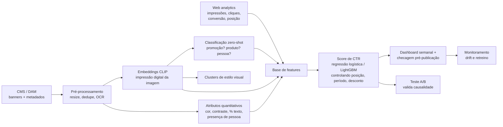

# Seção 2 — Inovação e Arquitetura de IA: scoring de banners

## Resumo executivo

- **Posição: eu não seguiria com o projeto como ele está.** A ideia é boa, mas está crua: não há KPI definido, nem critério do que é um banner "bom", nem decisão de negócio clara que o score vá apoiar. Construir o pipeline agora seria otimizar uma métrica que ninguém escolheu. O primeiro passo é entender o escopo; só depois uma PoC e, se ela provar valor, um MVP.
- O problema não é a ferramenta, é a pergunta. Antes de escolher tecnologia, definimos qual decisão o score vai apoiar e qual KPI prova que funcionou (CTR e receita por sessão, não "beleza").
- A ferramenta no-code não homologada é uma restrição de compliance, não um bloqueio. Seguimos em duas trilhas: MVP dentro do ambiente já homologado e, em paralelo, pedido formal de avaliação da ferramenta com Segurança da Informação e Jurídico.
- Tecnicamente: embeddings de imagem (CLIP) transformam cada banner em uma "impressão digital numérica". Sobre ela classificamos atributos (zero-shot), agrupamos estilos visuais e treinamos um score que prevê clique, controlando posição, período e desconto.
- MVP de 4 semanas com gate de go/no-go. O score só vale se ganhar um teste A/B.
- Custo × retorno por ponto de equilíbrio: o MVP se paga se gerar receita incremental equivalente a uma fração pequena da receita mensal do e-commerce (seção 3.3).

---

## 1. Condução do problema com o time

### 1.1 Do "qual ferramenta" para "qual decisão"

O time chegou com uma solução (pipeline no-code). O primeiro passo é voltar ao problema, numa sessão de discovery curta:

| Pergunta | Por que importa |
|---|---|
| Qual decisão o score vai mudar? (escolher banner da home, priorizar criativos, orientar briefing da agência) | Define se precisamos de ranking, classificação ou diagnóstico. |
| Como sabemos que deu certo? | Define o KPI: CTR, conversão pós-clique, receita por sessão. |
| O que é um banner "bom" hoje e quem decide? | Revela o critério atual (gosto, guideline de marca, dado). |
| Quem usa o resultado e com que frequência? | Define se é batch semanal ou checagem antes de publicar. |
| Que dados existem? (banners históricos, impressões, cliques, posição, campanha) | Sem histórico de performance, não há score supervisionado, só descritivo. |

### 1.2 Sequência: escopo → PoC → MVP

| Etapa | Duração | Pergunta que responde | Sai com |
|---|---|---|---|
| Entendimento de escopo | 1-2 semanas | Qual decisão, qual KPI, que dados existem? | KPI escolhido, inventário de dados, critério de sucesso |
| PoC | 2 semanas | Existe sinal? Atributos visuais se relacionam com o KPI? | Análise descritiva com banners históricos; go/no-go |
| MVP | 4 semanas | O score melhora o KPI de verdade? | Score + teste A/B; go/no-go para escala |

Se o entendimento de escopo mostrar que não há dado de performance por banner, a PoC muda de "score preditivo" para "catálogo visual descritivo" (clusters e atributos), que já tem valor para o time de criação.

### 1.3 A ferramenta não homologada: compliance, não bloqueio

A homologação existe por bons motivos: imagens de campanha podem conter pessoas (direito de imagem, contratos com embaixadores), material não lançado (sigilo comercial) e dados de performance. Enviar isso a uma ferramenta não avaliada é risco jurídico e de marca.

Caminho proposto, em paralelo:
1. **Trilha MVP:** construir no ambiente de dados e nuvem já homologados pelo grupo, com o time de dados como executor técnico.
2. **Trilha homologação:** se a ferramenta no-code for essencial para a autonomia do time, abrir o processo formal de avaliação de fornecedor com Segurança da Informação e Jurídico, com o MVP servindo de caso de uso.
3. **Sandbox:** enquanto não há aprovação, testes só com banners já publicados (públicos), sem dados de cliente.

### 1.4 Um time sem programação continua dono do problema

| Time do hackathon | Time de dados |
|---|---|
| Define critérios de "bom" e rotula uma amostra de banners | Constrói pipeline, embeddings e modelo |
| Formula hipóteses ("banner com pessoa converte mais?") | Testa as hipóteses com dado |
| Desenha e acompanha o A/B | Mede e reporta significância |
| Usa o resultado num dashboard ou planilha | Mantém, monitora e retreina |

O entusiasmo do hackathon é ativo da cultura de inovação. A mensagem para o time é "vamos chegar lá por um caminho seguro", não "não pode".

### 1.5 Que score? Cenários possíveis

"Score de banner" pode significar coisas muito diferentes. Cada cenário apoia uma decisão distinta e exige dados distintos. Escolher um é a principal saída do entendimento de escopo.

| Score | O que mede | Decisão que apoia | Dado necessário | Armadilha |
|---|---|---|---|---|
| CTR | Cliques ÷ impressões | Qual banner vai para a home | Impressões e cliques por banner e posição | Premia o chamativo, não o que vende |
| Conversão pós-clique | Pedidos ÷ cliques | Qual banner traz quem compra | Clique ligado à sessão e ao pedido | Volume baixo por banner; ruído alto |
| Receita por impressão (RPM) | Receita atribuída ÷ impressões | Priorizar espaço nobre da home | CTR × conversão × ticket | Atribuição: a compra pode ter outra origem |
| Engajamento | Tempo na página de destino, rolagem, rejeição | Banner que leva a uma página que prende | Analytics da página de destino | Tempo alto pode ser confusão, não interesse |
| Adição ao carrinho | Add-to-cart ÷ cliques | Banner de produto/lançamento | Eventos de carrinho por origem | Carrinho abandonado não é venda |
| Fadiga criativa | Queda de CTR ao longo dos dias | Quando trocar o banner | Série diária de CTR por banner | Confunde fadiga com sazonalidade |
| Aderência à marca (qualitativo) | Distância do banner ao guideline | Revisão antes de publicar | Guideline + banners aprovados como referência | Subjetivo; precisa de rótulo humano |
| Acessibilidade / legibilidade | Contraste, tamanho e proporção de texto | Checagem técnica pré-publicação | Só a imagem | Não diz nada sobre venda |

Recomendação inicial: **receita por impressão** como KPI de negócio, com CTR e conversão como diagnósticos. Os três qualitativos/técnicos (marca, acessibilidade, fadiga) entram como checagens, não como score principal.

### 1.6 Provocações para a discussão (hipóteses, sem dado ainda)

Sem dados de banners, o valor está em fazer as perguntas certas. Algumas, ligadas ao que vimos na Seção 1:

1. **CTR alto pode vender pior.** Na base de vendas, novembro teve desconto médio de 55% e ticket de R$ 59; junho, desconto de 35% e ticket de R$ 93. Um score de CTR tende a premiar banners de desconto agressivo, que atraem clique mas, pelo padrão observado, trazem pedidos menores. Por isso receita por impressão, e não CTR.
2. **O App é 76% da receita.** Banner pensado para desktop pode ser o menos visto. O score deveria ser por canal e formato, não um só.
3. **O horário muda o público.** O Site vende mais pela manhã e o App é mais noturno. O mesmo banner pode performar diferente conforme o horário em que é exibido; rotação por horário é um teste barato.
4. **O "banner bonito" pode ser só o banner bem posicionado.** Sem controlar posição e período, o score aprende o calendário promocional, não a imagem.
5. **Datas especiais se comportam como outro negócio.** Dia das Mães teve pico na véspera (sábado), não no domingo. A troca de banner precisa acompanhar a curva de compra, não a data comemorativa.
6. **Pessoa no banner vende mais?** Hipótese clássica, mas com risco de viés: se o histórico favoreceu um perfil de modelo, o score reproduz. Testar com A/B e auditar por atributo.

---

## 2. Implementação técnica (sem impeditivos ferramentais)

### 2.1 Arquitetura

### 2.2 Componentes

| Etapa | Escolha | Por quê |
|---|---|---|
| Embeddings | CLIP (open-source; ex.: ViT-B/32) | Coloca imagem e texto no mesmo espaço: permite perguntar "este banner mostra uma promoção?" sem treinar nada (zero-shot). Roda em CPU para centenas de imagens. |
| Atributos quantitativos | OpenCV + OCR | Brilho, contraste, cor dominante, proporção de texto, preço visível. Explicáveis para o time de criação. |
| Atributos qualitativos | Zero-shot CLIP com rótulos definidos pelo time | "Produto em destaque", "pessoa", "fundo claro", "preço/desconto", "lançamento". |
| Estilos visuais | K-means sobre embeddings | Revela famílias de banner e permite comparar performance por família. |
| Score | Regressão logística (MVP) → LightGBM | Prever CTR a partir de embeddings + atributos + contexto. Começar simples. |
| Busca por similaridade | FAISS (fase de escala) | "Mostre banners parecidos com este que performaram bem." |
| Serviço | Batch semanal (MVP) → API (escala) | O MVP não precisa de tempo real. |
| Monitoramento | Drift dos embeddings e do CTR | Nova identidade visual ou sazonalidade mudam o padrão. |

Opção complementar: um LLM multimodal (via provedor homologado) pode gerar uma crítica em linguagem natural de cada banner frente ao guideline de marca. Útil para o lado qualitativo e para o time sem programação; custo por imagem e consistência precisam ser avaliados.

### 2.3 Prova de conceito: o que uma demo de 32 banners já mostra

Para testar a peça central da arquitetura sem usar dado da marca, geramos 32 banners sintéticos com gabarito conhecido (fundo, cor, mensagem, preço, frasco) e rodamos o CLIP (`notebooks/04_demo_clip.ipynb`).

| Atributo | Zero-shot (sem treino) | Clusters (sem rótulo) | Classificador com 24 exemplos rotulados |
|---|---|---|---|
| Cor dominante | 100% | — | 94% |
| Mensagem (promoção × lançamento) | 31% | separa 100% | 100% |
| Fundo claro × escuro | 56% | — | 66% |
| Preço visível | 50% | — | 19% |
| Frasco de produto | 50% | — | 25% |

Acaso = 50% nos atributos de duas classes. Velocidade: 38 ms por banner em CPU (10 mil banners ≈ 6 minutos).

O que isso ensina para o MVP:
1. **O embedding captura o que é grande e dominante** (cor, tipo de mensagem). Os clusters separaram promoção de lançamento sem nenhum rótulo.
2. **Zero-shot depende de fazer a pergunta certa.** Prompts em inglês não casaram com "50% OFF" e "NOVO" em português. Com só 24 exemplos rotulados, um classificador simples acerta 100%. Rotular uma amostra pequena é exatamente o papel do time do hackathon.
3. **Detalhes pequenos não aparecem no embedding global** (preço, frasco). Por isso a arquitetura combina embeddings com OCR e atributos quantitativos.

Limite: banners sintéticos são mais simples que os reais, e a demo não mede performance comercial (não há dado de clique). Ela valida componentes, não o score.

### 2.4 O ponto técnico que mais importa: causalidade

Um banner na primeira posição da home durante a Black Friday tem CTR alto por causa da posição e do momento, não da imagem. Se o modelo não controlar isso, ele aprende "banner de Black Friday é bom". Por isso:
- posição, período, campanha e desconto entram como variáveis de controle;
- o score é validado com teste A/B (mesma posição, mesmo período, criativos diferentes) antes de virar critério de decisão.

---

## 3. Justificativa para a gestão sênior

### 3.1 Tradução

| Termo técnico | Como explicar |
|---|---|
| Embedding | Uma impressão digital numérica da imagem: banners parecidos têm impressões parecidas. |
| Zero-shot | O modelo reconhece "tem uma pessoa" ou "tem preço" sem precisar de exemplos rotulados. |
| Score | A chance de clique esperada para este banner, comparada a banners parecidos na mesma posição. |
| Teste A/B | Metade do público vê o banner A, metade vê o B; a diferença de clique é a prova. |

### 3.2 MVP de 4 semanas

| Semana | Entrega | Gate |
|---|---|---|
| 1 | Discovery, KPI definido, base de banners históricos + métricas de clique | Existem dados de performance suficientes? (ex.: 200+ banners com impressões) |
| 2 | Embeddings, atributos, clusters, zero-shot | Os clusters fazem sentido para o time de criação? |
| 3 | Score de CTR com validação temporal | O score bate a régua (CTR médio da posição)? |
| 4 | Desenho e início do A/B | Go/no-go para escala depende do A/B |

Equipe: 1 cientista de dados dedicado, apoio parcial de engenharia de dados e o time do hackathon como dono do negócio. Infraestrutura: nuvem homologada existente; CLIP roda em CPU nesse volume, então custo de GPU é marginal.

### 3.3 Custo × retorno: ponto de equilíbrio

Em vez de prometer um uplift, mostramos quanto o MVP precisa entregar para se pagar.

- Receita do e-commerce na base do case: R$ 490 mi em 8 meses ≈ R$ 61 mi/mês.
- Custo do MVP: C (pessoas + infraestrutura por 4 semanas; valor a preencher com o custo real do time).
- Ponto de equilíbrio no primeiro mês após o go: receita incremental ≥ C.

| Custo do MVP (C) | Receita incremental necessária em 1 mês | % da receita mensal |
|---|---|---|
| R$ 50 mil | R$ 50 mil | 0,08% |
| R$ 100 mil | R$ 100 mil | 0,16% |
| R$ 200 mil | R$ 200 mil | 0,33% |

Leitura: se o melhor banner na home influenciar mesmo uma fração pequena das vendas, a conta fecha rápido. O A/B mede exatamente essa fração. Os valores de C são ilustrativos; a receita vem do dado do case e pode ser uma amostra do total real.

Retornos não financeiros: briefing de criação baseado em dado, menos tempo de revisão manual, e a mesma infraestrutura de embeddings reaproveitável para busca no DAM, detecção de duplicados e checagem de guideline de marca.

### 3.4 Riscos, levantados antes da pergunta

| Risco | Mitigação |
|---|---|
| LGPD e direito de imagem (pessoas nos banners) | Detectar presença de pessoa, nunca identificar quem é; nenhum dado de cliente no pipeline; validação do Jurídico. |
| Viés (corpos, etnias, faixas de preço) | Se o histórico favoreceu um perfil, o score repete. Auditar o score por atributo e nunca usar como critério único de veto. |
| Brand safety | Score apoia a decisão; aprovação final segue com marca e criação. |
| Correlação ≠ causa | Controles de posição/período e A/B obrigatório antes de escalar. |
| Drift | Nova identidade visual ou campanha muda o padrão: monitorar e retreinar mensalmente. |
| Dependência do time de dados | Interface simples para o time do hackathon e documentação; trilha de homologação para autonomia futura. |

### 3.5 Roadmap

Entendimento de escopo (1-2 semanas, KPI e dados) → PoC (2 semanas, banners históricos, descritivo) → MVP (4 semanas, score + A/B) → Escala (API pré-publicação, busca por similaridade, novos canais como App e e-mail). Cada passagem depende de um gate com critério numérico.

### 3.6 O que pedimos à liderança

1. Acesso aos dados de performance de banners (impressões, cliques, posição).
2. Um sponsor de negócio para o A/B.
3. Aval para a trilha de homologação com Segurança da Informação e Jurídico.
4. Quatro semanas de um cientista de dados.
