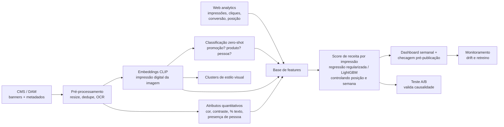

# Seção 2 — Inovação e Arquitetura de IA: scoring de banners

## Resumo executivo

- **Posição: eu não seguiria com o projeto como ele está.** A ideia é boa, mas está crua: não há KPI definido, nem critério do que é um banner "bom", nem decisão de negócio clara que o score vá apoiar. Construir o pipeline agora seria otimizar uma métrica que ninguém escolheu. O primeiro passo é entender o escopo; só depois uma PoC e, se ela provar valor, um MVP.
- O problema não é a ferramenta, é a pergunta. Antes de escolher tecnologia, definimos qual decisão o score vai apoiar e qual KPI prova que funcionou: recomendamos **receita por impressão**, não CTR nem "beleza".
- A ferramenta no-code não homologada é uma restrição de compliance, não um bloqueio. Seguimos em duas trilhas: MVP dentro do ambiente já homologado e, em paralelo, pedido formal de avaliação da ferramenta com Segurança da Informação e Jurídico.
- Tecnicamente: embeddings de imagem (CLIP) transformam cada banner em uma "impressão digital numérica". Sobre ela classificamos atributos, agrupamos estilos visuais e treinamos um score de receita por impressão, controlando posição e semana.
- Sequência de 7–8 semanas: escopo (1–2), PoC (2) e MVP (4), com critério de parada em cada etapa. O score só vale se ganhar um teste A/B.
- Custo × retorno sobre **margem**: o ponto de equilíbrio explicita quanto o score precisa mover a receita influenciada pelos banners. Com as premissas ilustrativas, 0,10% da receita total paga o investimento em cerca de 12 meses; os gates limitam a perda a R$ 100 mil (seção 3.3).

---

## 1. Condução do problema com o time

### 1.1 Do "qual ferramenta" para "qual decisão"

O time chegou com uma solução (pipeline no-code). O primeiro passo é voltar ao problema, numa sessão de discovery curta:

| Pergunta | Por que importa |
|---|---|
| Qual decisão o score vai mudar? (escolher banner da home, priorizar criativos, orientar briefing da agência) | Define se precisamos de ranking, classificação ou diagnóstico. |
| Como sabemos que deu certo? | Define o KPI: CTR, conversão pós-clique, receita por sessão. |
| O que é um banner "bom" hoje e quem decide? | Revela o critério atual (gosto, guideline de marca, dado). |
| Quem usa o resultado e com que frequência? | Define se é batch semanal ou checagem antes de publicar. |
| Que dados existem? (banners históricos, impressões, cliques, posição, campanha) | Sem histórico de performance, não há score supervisionado, só descritivo. |

### 1.2 Sequência: escopo → PoC → MVP

| Etapa | Duração | Pergunta que responde | Sai com |
|---|---|---|---|
| Entendimento de escopo | 1-2 semanas | Qual decisão, qual KPI, que dados existem? | KPI escolhido, inventário de dados, critério de sucesso |
| PoC | 2 semanas | Existe sinal? Atributos visuais se relacionam com o KPI? | Análise descritiva com banners históricos; go/no-go |
| MVP | 4 semanas | O score melhora o KPI de verdade? | Score + teste A/B; go/no-go para escala |

Se o entendimento de escopo mostrar que não há dado de performance por banner, a PoC muda de "score preditivo" para "catálogo visual descritivo" (clusters e atributos), que já tem valor para o time de criação.

### 1.3 A ferramenta não homologada: compliance, não bloqueio

A homologação existe por bons motivos: imagens de campanha podem conter pessoas (direito de imagem, contratos com embaixadores), material não lançado (sigilo comercial) e dados de performance. Enviar isso a uma ferramenta não avaliada é risco jurídico e de marca.

Caminho proposto, em paralelo:
1. **Trilha MVP:** construir no ambiente de dados e nuvem já homologados pelo grupo, com o time de dados como executor técnico.
2. **Trilha homologação:** se a ferramenta no-code for essencial para a autonomia do time, abrir o processo formal de avaliação de fornecedor com Segurança da Informação e Jurídico, com o MVP servindo de caso de uso.
3. **Sandbox:** enquanto não há aprovação, testes só com banners já publicados (públicos), sem dados de cliente.

### 1.4 Roteiro da primeira conversa com o time

1. **Reconhecer a iniciativa:** a ideia nasceu de quem conhece os banners por dentro; é exatamente o tipo de inovação que queremos.
2. **Separar problema de ferramenta:** "a ferramenta não está homologada; o problema que vocês acharam continua de pé, e vamos resolvê-lo".
3. **Fazer as perguntas de escopo** (seção 1.1) juntos, saindo com a decisão que o score apoia e o KPI.
4. **Combinar o que começa já, sem esperar a homologação:** rotular uma amostra de banners (o que é "bom" para vocês?), levantar o histórico de performance com o time de web analytics, e explorar o que dá para fazer nas ferramentas já homologadas (planilhas e painéis corporativos).
5. **Definir papéis e prazos:**

| Quem | Responsável por |
|---|---|
| Time do hackathon | Dono do problema: KPI, rótulos, hipóteses, acompanhamento do A/B |
| Time de dados | Pipeline, embeddings, modelo, validação |
| Segurança da Informação | Parecer sobre a ferramenta no-code (prazo combinado na abertura do processo) |
| Jurídico | Direito de imagem e uso de material de campanha |
| Sponsor de negócio | Aprovar o A/B e o espaço de teste |

### 1.5 Um time sem programação continua dono do problema

| Time do hackathon | Time de dados |
|---|---|
| Define critérios de "bom" e rotula uma amostra de banners | Constrói pipeline, embeddings e modelo |
| Formula hipóteses ("banner com pessoa converte mais?") | Testa as hipóteses com dado |
| Desenha e acompanha o A/B | Mede e reporta significância |
| Usa o resultado num dashboard ou planilha | Mantém, monitora e retreina |

O entusiasmo do hackathon é ativo da cultura de inovação. A mensagem para o time é "vamos chegar lá por um caminho seguro", não "não pode".

### 1.6 Que score? Cenários possíveis

"Score de banner" pode significar coisas muito diferentes. Cada cenário apoia uma decisão distinta e exige dados distintos. Escolher um é a principal saída do entendimento de escopo.

| Score | O que mede | Decisão que apoia | Dado necessário | Armadilha |
|---|---|---|---|---|
| CTR | Cliques ÷ impressões | Qual banner vai para a home | Impressões e cliques por banner e posição | Premia o chamativo, não o que vende |
| Conversão pós-clique | Pedidos ÷ cliques | Qual banner traz quem compra | Clique ligado à sessão e ao pedido | Volume baixo por banner; ruído alto |
| Receita por impressão (RPM) | Receita atribuída ÷ impressões | Priorizar espaço nobre da home | CTR × conversão × ticket | Atribuição: a compra pode ter outra origem |
| Engajamento | Tempo na página de destino, rolagem, rejeição | Banner que leva a uma página que prende | Analytics da página de destino | Tempo alto pode ser confusão, não interesse |
| Adição ao carrinho | Add-to-cart ÷ cliques | Banner de produto/lançamento | Eventos de carrinho por origem | Carrinho abandonado não é venda |
| Fadiga criativa | Queda de CTR ao longo dos dias | Quando trocar o banner | Série diária de CTR por banner | Confunde fadiga com sazonalidade |
| Aderência à marca (qualitativo) | Distância do banner ao guideline | Revisão antes de publicar | Guideline + banners aprovados como referência | Subjetivo; precisa de rótulo humano |
| Acessibilidade / legibilidade | Contraste, tamanho e proporção de texto | Checagem técnica pré-publicação | Só a imagem | Não diz nada sobre venda |

Recomendação inicial: **receita por impressão** como KPI de negócio, com CTR e conversão como diagnósticos. Os três qualitativos/técnicos (marca, acessibilidade, fadiga) entram como checagens, não como score principal.

### 1.7 Provocações para a discussão (hipóteses, sem dado ainda)

Sem dados de banners, o valor está em fazer as perguntas certas. Algumas, ligadas ao que vimos na Seção 1:

1. **CTR alto pode vender pior.** Na base de vendas, novembro teve desconto médio de 55% e ticket de R$ 59; junho, desconto de 35% e ticket de R$ 93. Um score de CTR tende a premiar banners de desconto agressivo, que atraem clique mas, pelo padrão observado, trazem pedidos menores. Por isso receita por impressão, e não CTR.
2. **O App representa 76% da receita no período; 79% em junho.** Banner pensado para desktop pode ser o menos visto. O score deveria ser por canal e formato, não um só.
3. **O horário muda o público.** Os dois canais têm pico às 11h; o App tem um segundo pico às 20–21h. O mesmo banner pode performar diferente conforme o horário em que é exibido; rotação por horário é um teste barato.
4. **O "banner bonito" pode ser só o banner bem posicionado.** Sem controlar posição e período, o score aprende o calendário promocional, não a imagem.
5. **Datas especiais se comportam como outro negócio.** Dia das Mães teve pico na véspera (sábado), não no domingo. A troca de banner precisa acompanhar a curva de compra, não a data comemorativa.
6. **Pessoa no banner vende mais?** Hipótese clássica, mas com risco de viés: se o histórico favoreceu um perfil de modelo, o score reproduz. Testar com A/B e auditar por atributo.

---

## 2. Implementação técnica (sem impeditivos ferramentais)

### 2.1 Arquitetura

### 2.2 Componentes

| Etapa | Escolha | Por quê |
|---|---|---|
| Embeddings | CLIP (aberto; ViT-B/32) | Régua de custo zero que coloca imagem e texto no mesmo espaço, permite zero-shot e roda em CPU para centenas de imagens. |
| Atributos quantitativos | OpenCV + OCR | Brilho, contraste, cor dominante, proporção de texto, preço visível. Explicáveis para o time de criação. |
| Atributos qualitativos | Zero-shot CLIP com rótulos definidos pelo time | "Produto em destaque", "pessoa", "fundo claro", "preço/desconto", "lançamento". |
| Estilos visuais | K-means sobre embeddings | Revela famílias de banner e permite comparar performance por família. |
| Score | Regressão regularizada ponderada por impressões | Estimar receita por impressão a partir de embeddings, atributos e contexto sem dar o mesmo peso a banners com volumes muito diferentes. |
| Busca por similaridade | FAISS (fase de escala) | "Mostre banners parecidos com este que performaram bem." |
| Serviço | Batch semanal (MVP) → API (escala) | O MVP não precisa de tempo real. |
| Monitoramento | Drift dos embeddings e da receita por impressão | Nova identidade visual ou sazonalidade mudam o padrão. |

CLIP B/32 é a régua (aberto, roda em CPU, custo zero); no MVP, comparamos com SigLIP 2 multilíngue e com um LLM multimodal homologado no mesmo conjunto rotulado, e fica o que acertar mais por real gasto. A tentativa local do SigLIP 2 não produziu resultado porque os pesos não estavam no cache e a conexão ao Hugging Face falhou na validação do certificado; o código com prompts em português ficou preparado no notebook.

O LLM multimodal pode gerar uma crítica em linguagem natural frente ao guideline de marca. É útil para o lado qualitativo e para o time sem programação; custo por imagem, consistência, termos de uso e retenção dos dados pelo provedor precisam ser avaliados.

### 2.3 Prova de conceito: o que uma demo de 32 banners já mostra

Para testar a peça central da arquitetura sem usar dado da marca, geramos 32 banners sintéticos. Cada atributo do gabarito (fundo, cor, mensagem, preço e frasco) é sorteado separadamente com seed 42 e marginais balanceadas. O classificador é treinado com 24 banners e testado nos 8 restantes, em 4 rodadas; repetimos o particionamento 20 vezes e reportamos média (mínimo–máximo).

| Atributo | CLIP zero-shot | CLIP + 24 rótulos | Atributos simples |
|---|---:|---:|---:|
| Cor dominante | 100,0% | 94,8% (87,5–96,9%) | 95,0% (90,6–100,0%) |
| Mensagem (promoção × lançamento) | 31,2% | 100,0% (100,0–100,0%) | 55,5% (46,9–65,6%) |
| Fundo claro × escuro | 59,4% | 71,9% (53,1–87,5%) | 100,0% (100,0–100,0%) |
| Preço visível | 50,0% | 54,7% (37,5–62,5%) | 100,0% (100,0–100,0%) |
| Frasco de produto | 50,0% | 51,6% (34,4–65,6%) | 100,0% (100,0–100,0%) |

Acaso = 50% nos atributos binários e 25% na cor. Em CPU, após aquecimento, o lote ficou em 32,3 ms por banner (30,4–34,3; cinco repetições), projetando 10 mil banners em 5,4 minutos (5,1–5,7). Um banner por chamada ficou em 48,1 ms (47,4–49,2), ou 8,0 minutos para 10 mil.

O que isso ensina para o MVP:
1. **O embedding captura o que é grande e dominante** (cor e tipo de mensagem). Com 24 rótulos, o classificador chega a 100% em mensagem.
2. **Zero-shot depende de linguagem e prompt.** Os prompts em inglês não casaram bem com "50% OFF" e "NOVO" em português. Um modelo multilíngue deve ser comparado no mesmo gabarito quando os pesos estiverem disponíveis.
3. **Medidas simples complementam o embedding.** Brilho, contraste, cor média, bordas da caixa de preço e pixels do frasco acertaram fundo, preço e produto, justamente onde o embedding global ficou instável ou perto do acaso.

No desenho anterior, preço e frasco eram derivados por paridade dos demais atributos, criando correlações que podiam se inverter entre treino e teste. Com sorteios independentes, o probe do CLIP volta para perto do acaso nesses dois atributos: 54,7% e 51,6% na média. Fundo contém algum sinal visual no embedding (71,9%), mas a faixa de 53,1% a 87,5% mostra a incerteza da amostra pequena.

Limite: banners sintéticos são mais simples que os reais, e a demo não mede performance comercial (não há dado de clique). Ela valida componentes, não o score.

### 2.4 Como o embedding vira nota

| Peça | Especificação do MVP |
|---|---|
| Unidade | Um banner exibido em um espaço (posição) numa semana |
| Alvo | Receita atribuída ÷ impressões, com regressão ponderada por impressões; alternativa: modelar clique → pedido → receita usando impressões como exposição |
| Variáveis da imagem | Componentes principais do embedding (≈ 20–50), atributos de OCR (preço visível, % de texto) e atributos quantitativos (cor, contraste) |
| Controles | Somente fatos conhecidos antes da publicação: canal, espaço, data planejada, campanha e desconto registrados no briefing; efeitos hierárquicos por espaço evitam misturar posições incomparáveis |
| Modelo | Regressão regularizada no MVP; efeitos hierárquicos por espaço; LightGBM apenas se volume e ganho fora da amostra justificarem |
| Validação | Temporal e agrupada por campanha: nenhuma peça da mesma campanha aparece simultaneamente em treino e teste; comparar ranking e calibração nas campanhas seguintes |
| Saída | Nota relativa dentro do espaço, com intervalo de incerteza e atributos que mais pesaram; não publicar nota quando o intervalo for largo demais |
| Infraestrutura | Vetores no catálogo do DAM; lote aquecido em CPU: 32,3 ms/banner em média, 10 mil em cerca de 5,4 minutos |

### 2.5 O ponto técnico que mais importa: causalidade

Um banner na primeira posição da home durante a Black Friday tem CTR alto por causa da posição e do momento, não da imagem. Se o modelo não controlar isso, ele aprende "banner de Black Friday é bom". Por isso:
- posição, período, campanha e desconto entram como variáveis de controle;
- o score é validado com teste A/B (mesma posição, mesmo período, criativos diferentes) antes de virar critério de decisão.

---

## 3. Justificativa para a gestão sênior

### 3.1 Tradução

| Termo técnico | Como explicar |
|---|---|
| Embedding | Uma impressão digital numérica da imagem: banners parecidos têm impressões parecidas. |
| Zero-shot | O modelo reconhece "tem uma pessoa" ou "tem preço" sem precisar de exemplos rotulados. |
| Score | A receita esperada por impressão deste banner, comparada a banners no mesmo espaço e período. |
| Teste A/B | Metade do público vê o banner A, metade vê o B; a diferença medida é a prova. |

### 3.2 MVP de 4 semanas (depois de escopo e PoC: 7–8 semanas no total)

| Semana do MVP | Entrega | Segue se… |
|---|---|---|
| 1 | Base de banners históricos com impressões, cliques e receita atribuída, por espaço e semana | Há dado suficiente (ex.: 200+ banners com impressões) |
| 2 | Embeddings, atributos, clusters | Os grupos fazem sentido para o time de criação |
| 3 | Score de receita por impressão com validação temporal | O ranking do score bate a régua (média histórica do espaço) |
| 4 | Desenho e início do A/B | O A/B decide a escala |

Equipe: 1 cientista de dados dedicado, apoio parcial de engenharia de dados e o time do hackathon como dono do negócio. Infraestrutura: nuvem homologada existente; CLIP roda em CPU nesse volume, então custo de GPU é marginal.

### 3.3 Custo × retorno

Todos os valores de custo, margem e ganho são **premissas ilustrativas** a substituir pelos números de Finanças. A base do case soma R$ 490,3 milhões em oito meses, ou R$ 61,3 milhões/mês. Premissas: escopo + PoC + MVP = R$ 100 mil uma vez; operação = R$ 10 mil/mês; margem de contribuição = 30% da receita incremental.

A ponte entre teste e resultado total é explícita: se `f` é a fração da receita mensal influenciada pelos espaços testados e `u` é o ganho relativo nesses espaços, o ganho equivalente sobre o e-commerce é `f × u`. Por exemplo, se os espaços influenciam 20% da receita, elevar esses espaços em 0,50% equivale a 0,10% da receita total. O histórico de atribuição deve estimar `f`; até lá, isto é premissa, não promessa.

| Ganho equivalente sobre a receita mensal | Resultado com as premissas |
|---:|---|
| Abaixo de ≈ 0,05% | Não cobre nem os R$ 10 mil/mês de operação |
| 0,10% | ≈ R$ 61,3 mil de receita, R$ 18,4 mil de margem e R$ 8,4 mil líquidos/mês; payback ≈ 12 meses |
| 0,15% | ≈ R$ 92 mil de receita, R$ 27,6 mil de margem e R$ 17,6 mil líquidos/mês; payback ≈ 6 meses |

O ponto exato que zera a operação é 0,054%; para recuperar R$ 100 mil em 12 meses, 0,100%; em seis meses, 0,145%. Se o A/B não mostrar efeito, o projeto para: a perda máxima é o gasto de escopo + PoC + MVP, R$ 100 mil, menor se um gate anterior interromper o trabalho. Não há custo recorrente depois da parada.

**Plano do A/B:** randomização persistente por usuário, não por impressão. Para detectar **+5% relativo (2,0% → 2,1%)** no CTR, com teste bicaudal, 80% de poder e 5% de significância, a conta de duas proporções é `n = [1,96√(2×0,0205×0,9795) + 0,84√(0,020×0,980 + 0,021×0,979)]² / 0,001² = 315.206`, ou aproximadamente **315 mil usuários expostos por variante** (630 mil no total). Com a premissa de 100 mil usuários únicos elegíveis por dia no espaço, são cerca de 6,3 dias; com 50 mil/dia, 12,6 dias. O prazo deve ser atualizado com o tráfego real antes do teste.

A receita por impressão é a guarda: a margem de não inferioridade proposta é **−1% relativo**, definida antes de abrir os dados. Só escalamos se o CTR subir e o limite inferior do intervalo de 95% da razão de receita por impressão ficar acima de 0,99. Finanças deve validar essa margem, e a receita continua sendo acompanhada por algumas semanas.

**Custo de não fazer:** decisões de criativo continuam sem dado; o time do hackathon, desmotivado, tende a buscar ferramentas paralelas sem governança, exatamente o risco que a homologação quer evitar.

Retornos não financeiros: briefing de criação baseado em dado, menos tempo de revisão manual, e a mesma infraestrutura de embeddings reaproveitável para busca no DAM, detecção de duplicados e checagem de guideline de marca.

### 3.4 Riscos, levantados antes da pergunta

| Risco | Mitigação |
|---|---|
| LGPD e direito de imagem (pessoas nos banners) | Detectar presença de pessoa, nunca identificar quem é; nenhum dado de cliente no pipeline; validação do Jurídico. |
| Viés (corpos, etnias, faixas de preço) | Se o histórico favoreceu um perfil, o score repete. Auditar o score por atributo e nunca usar como critério único de veto. |
| Brand safety | Score apoia a decisão; aprovação final segue com marca e criação. |
| Correlação ≠ causa | Controles de posição/período e A/B obrigatório antes de escalar. |
| Drift | Nova identidade visual ou campanha muda o padrão: monitorar e retreinar mensalmente. |
| Dependência do time de dados | Interface simples para o time do hackathon e documentação; trilha de homologação para autonomia futura. |
| Custo e tempo de rotulagem | Medir minutos por banner na PoC, limitar a taxonomia e amostrar casos de maior incerteza; incluir horas do time de criação no custo. |
| Provedor externo de LLM | Só enviar material a provedor homologado; revisar termos de uso, retenção, treinamento com entradas e localização dos dados. |
| Licença dos pesos | Registrar modelo, versão e licença; Jurídico confirma uso comercial e obrigações antes da produção. |

### 3.5 Roadmap

Entendimento de escopo (1-2 semanas, KPI e dados) → PoC (2 semanas, banners históricos, descritivo) → MVP (4 semanas, score + A/B) → Escala (API pré-publicação, busca por similaridade, novos canais como App e e-mail). Cada passagem depende de um gate com critério numérico.

### 3.6 O que pedimos à liderança

1. Acesso aos dados de performance de banners (impressões, cliques, posição).
2. Um sponsor de negócio para o A/B.
3. Aval para a trilha de homologação com Segurança da Informação e Jurídico.
4. Sete a oito semanas de um cientista de dados (escopo, PoC e MVP), com critério de parada em cada etapa.
